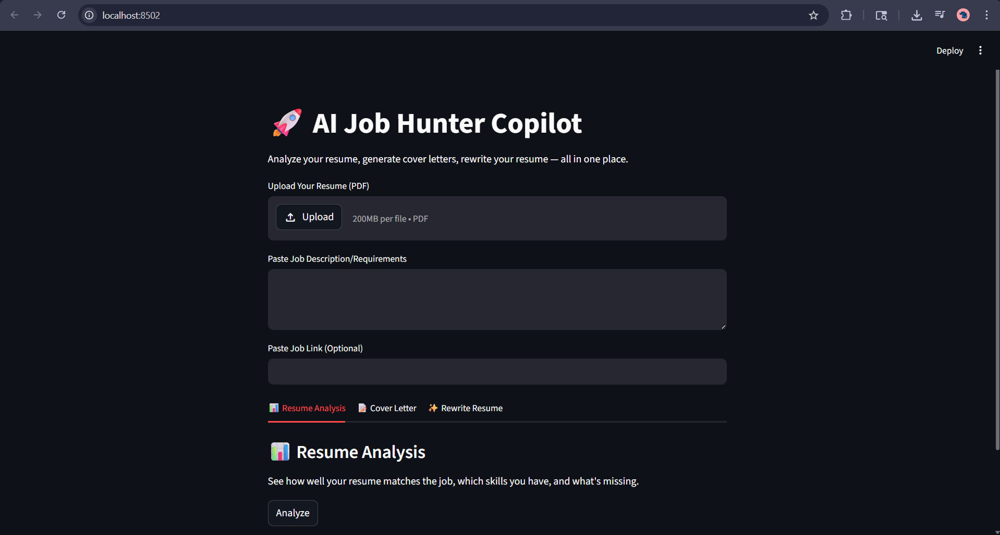
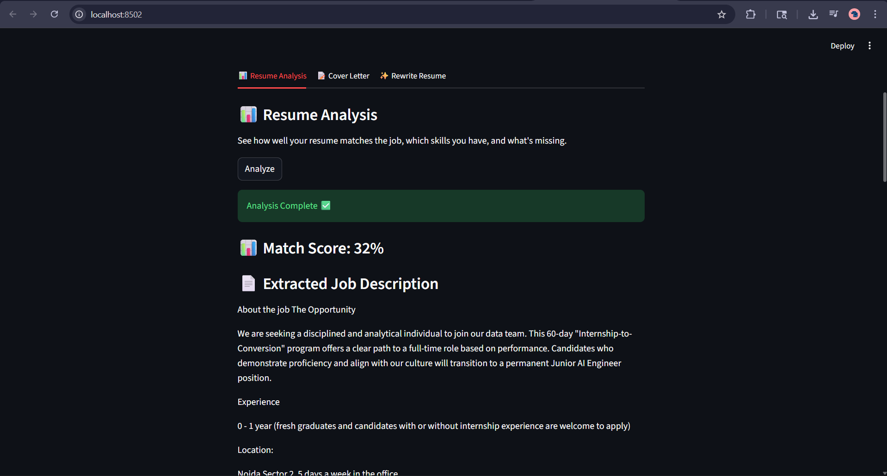
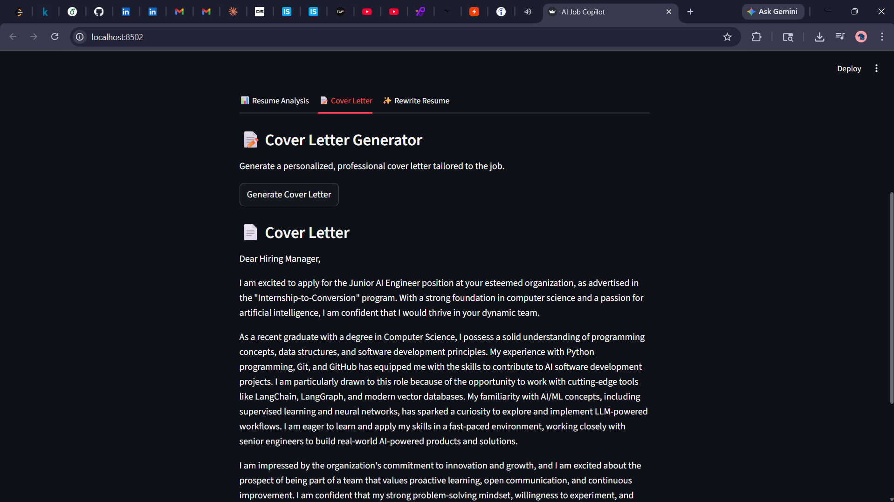
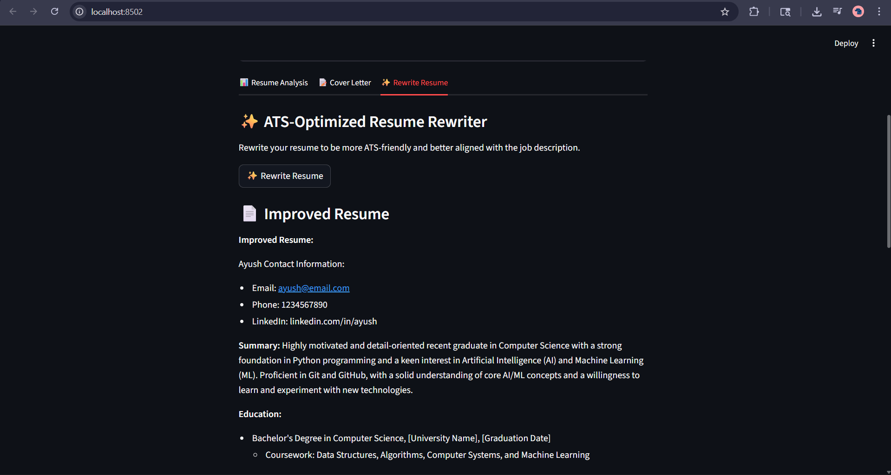

# 🚀 AI Job Hunter Copilot

An AI-powered Streamlit application that helps you **analyze resumes, match skills with job descriptions, generate cover letters, and rewrite resumes for ATS optimization** using Groq LLM (LLaMA 3).

---

## 📌 Overview

AI Job Hunter Copilot is a smart career assistant that automates the job application process. It helps users:

- 📊 Analyze resume vs job description
- 🎯 Match and compare skills
- 💡 Identify missing skills with suggestions
- 📝 Generate tailored resume bullet points
- 📄 Create professional cover letters
- ✨ Rewrite resumes for ATS optimization

---

## 📸 Screenshots

### 🏠 Home Page / Resume Upload


### 📊 Resume Analysis


### 📝 Cover Letter Generator


### ✨ Resume Rewriter (ATS Optimized)


---

## ⚙️ Features

### 📊 Resume Analysis
- Extracts text from PDF resume
- Extracts technical skills using LLM
- Compares resume skills with job description
- Calculates match score (%)
- Displays matched and missing skills

### 📝 Cover Letter Generator
- Generates personalized cover letters
- Tailored to resume + job description
- Professional 200–300 word format
- Downloadable output

### ✨ Resume Rewriter (ATS Optimizer)
- Improves resume structure and clarity
- Adds relevant keywords from job description
- Makes resume ATS-friendly
- Ensures no fake experience is added

### 💡 Smart Suggestions
- Suggests skills to learn
- Provides improvement roadmap based on missing skills

---

## 🧠 Tech Stack

- Python 🐍
- Streamlit 🎈
- Groq API (LLaMA 3.3 70B) 🤖
- PyPDF 📄
- BeautifulSoup + Requests 🌐
- LangChain 🔗
- dotenv 🔐

---

## 📁 Project Structure
AI Job Hunter Copilot/
│
├── app.py # Streamlit frontend
├── utils.py # Core AI + processing logic
├── .env # API keys (GROQ_API_KEY)
└── requirements.txt # Dependencies


---

## 🚀 Installation & Setup

### 1️⃣ Clone Repository
```bash
git clone https://github.com/AyushGup11/ai-job-hunter-copilot.git
cd ai-job-hunter-copilot

2️⃣ Create Virtual Environment

python -m venv venv
venv\Scripts\activate   # Windows

3️⃣ Install Dependencies

pip install -r requirements.txt

4️⃣ Setup API Key

Create a .env file:

GROQ_API_KEY=your_api_key_here

5️⃣ Run Application

streamlit run app.py