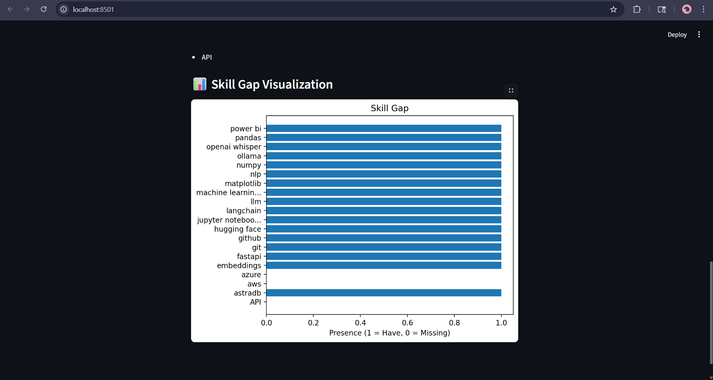

# 🚀 AI Job Hunter Copilot

> **Your AI-powered assistant to analyze resumes, compare job requirements, and identify skill gaps using RAG (Retrieval-Augmented Generation).**

---

## 🧠 Overview

AI Job Hunter Copilot helps you **bridge the gap between your skills and job requirements**.

It analyzes:

* 📄 Resume (PDF)
* 🌐 Job Description (URL)

Then:

* Extracts skills
* Compares them
* Identifies missing skills
* Suggests improvements
* Generates resume bullets & cover letters

---

## ✨ Features

* 📄 **Resume Parsing** (PDF → Text)
* 🔍 **Skill Extraction** (NLP-based)
* ⚖️ **Skill Comparison Engine**
* 📊 **Skill Gap Visualization**
* 🧠 **RAG-based Suggestions**
* ✍️ **AI Resume Bullet Generator**
* 💌 **Cover Letter Generator**
* 🌐 **Job Description Scraper**
* ♻️ **Resume Rewriter**

---

## 🏗️ Tech Stack

| Category         | Tools                             |
| ---------------- | --------------------------------- |
| 🧠 AI/ML         | LangChain, HuggingFace Embeddings |
| 🔎 RAG           | FAISS Vector Store                |
| 🖥️ Frontend      | Streamlit                         |
| ⚙️ Backend       | Python                            |
| 📊 Visualization | Matplotlib                        |
| 🌐 Scraping      | Requests, BeautifulSoup           |

---

## 📁 Project Structure

```
AI Job Hunter Copilot/
│
├── app.py                 # Main Streamlit app
├── utils.py               # Core logic (parsing, skills, generation)
├── vector_store.py        # FAISS + embeddings (RAG)
├── requirements.txt
└── README.md
```
   ---

## 📸 Screenshots

### 🏠 Home Page / Resume Upload


### 📊 Resume Analysis



### 📝 Cover Letter Generator


### ✨ Resume Rewriter (ATS Optimized)


---


---

## ⚙️ Setup Instructions

### 🔹 1. Clone the repository

```bash
git clone https://github.com/AyushGup11/ai-job-hunter-copilot.git
cd ai-job-hunter-copilot
```

### 🔹 2. Create virtual environment

```bash
python -m venv venv
venv\Scripts\activate   # Windows
```

### 🔹 3. Install dependencies

```bash
pip install -r requirements.txt
```

### 🔹 4. Run the app

```bash
streamlit run app.py
```

---

## 🐳 Docker Setup (Optional but Recommended)

### 🔹 Build Image

```bash
docker build -t ai-job-copilot .
```

### 🔹 Run Container

```bash
docker run -p 8501:8501 ai-job-copilot
```

---

## ☁️ AWS Deployment (EC2)

1. Launch EC2 (Ubuntu)
2. Install Docker
3. Run container
4. Open:

```
http://<your-ec2-ip>:8501
```

---

## 📊 How It Works

1. 📄 Upload Resume
2. 🌐 Paste Job URL
3. 🧠 Extract Skills
4. ⚖️ Compare Skills
5. 📊 Visualize Gap
6. ✍️ Generate Suggestions

---

## 📈 Use Cases

* 🎯 Job Preparation
* 📄 Resume Optimization
* 🧠 Skill Gap Analysis
* 🤖 AI-powered Career Guidance
* 📊 Portfolio Project (GenAI + RAG)

---

## 🔥 Key Highlights

* Implements **RAG pipeline** for contextual suggestions
* Uses **FAISS for semantic search**
* End-to-end **AI career assistant system**
* Deployable with **Docker + AWS**

---

## 🚀 Future Improvements

* 🔗 LinkedIn profile analysis
* 📊 Advanced dashboards (radar, scoring)
* 🤖 Personalized learning roadmap
* ☁️ Full cloud deployment (ECS, CI/CD)

---

## 🙌 Contributing

Contributions are welcome!
Feel free to fork and improve 🚀

---

## 📬 Contact

If you found this useful or want to collaborate:

* 💼 LinkedIn:https://www.linkedin.com/in/ayush-gupta-08a384265/
* 📧 Email: ayushgupta2131016@gmail.com

---

## ⭐ If you like this project

Give it a ⭐ on GitHub — it helps a lot!

---

> Built with 💡 to help developers land better jobs using AI
